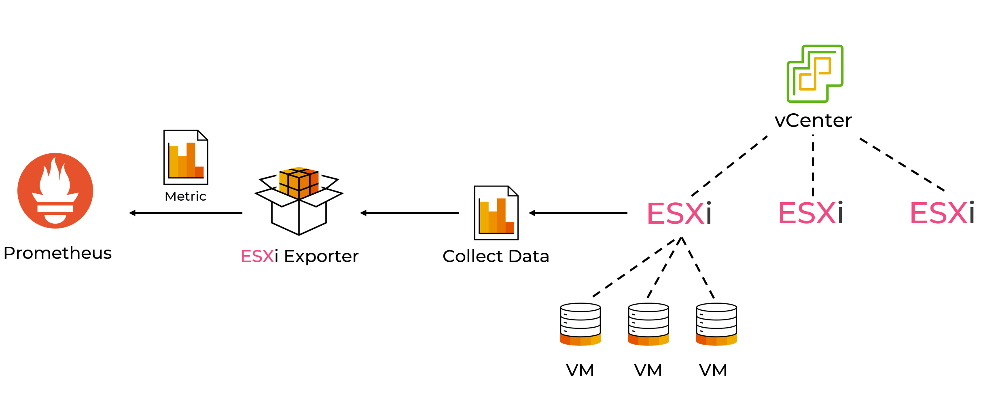
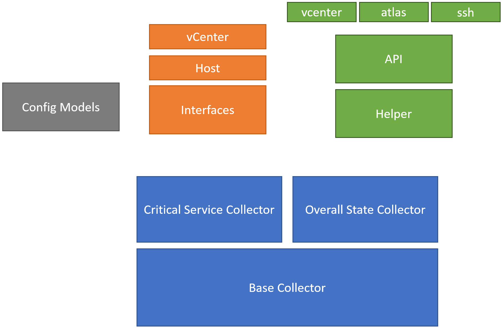
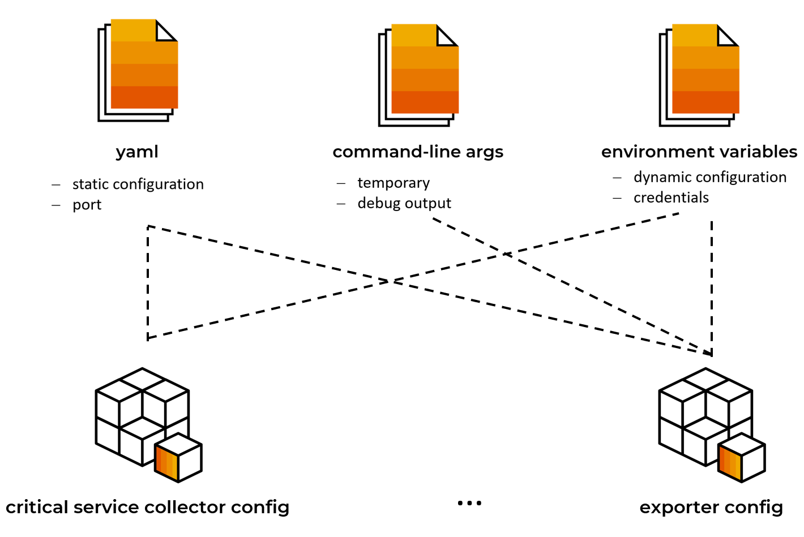

# ESXi-exporter
Prometheus exporter, which utilises the _VMware SDK_ and _SSH_ to get metrics from _VMware ESXi-HostSystems_.

## About
This exporter contains a `critical service collector` and a `overall state collector`. It monitors the service state of services like `hostd` or `ntpd` and gathers the _ESXi-HostSystem_ `overallState` from _vCenters_. 


## Getting started

1. Configure the project
    - Credentials are passed by environment variables.
    - `config.yaml` contains some static configuration
    - There are command-line options for more console output
2. Run `exporter.py` with _python3_

**Environment variables**
- `VCENTER_USER` the vCenter username
- `VCENTER_PASSWORD` the vCenter password
- `VCENTER_MPW` if set, master_password mechanism will be used.
- `ESXI_USER` the ESXi-host ssh username
- `ESXI_PASSWORD` the ESXi-host ssh password
- `ATLAS_FILE` the path to the [atlas file](https://github.com/sapcc/atlas) containing ESXi_Hosts and vCenters

**Command-line arguments**
- `-v` sets logger to info output
- `-vv` sets logger to debug output

## Atlas
https://github.com/sapcc/atlas

This is an atlas scheme reduced to the information required by this exporter.

```json
[
  {
    "labels": {
      "job": "vmware-esxi or vcenter",
      "name": "",
      "server_name": "",
      "status": "Active",
      "site": ""
    }
  },
]
```

## Structure

- All collectors inherit from the `BaseCollector`
- _Interfaces_ are used to provide a common exchange data type. Eg it defines how a _Host_ and a _Vcenter_ should be passed around. (the term _interface_ is used as in _Angular/Typescript_ vocabular)  
- _Modules_ provide shared core functionality
    - _api_ &rarr; very basic functionality. Enables connectivity to ESXi-hosts etc. They are designed in an interchangeable manner. See helpers which are some kind of wrapper.
    - _helper_ &rarr; Are some kind of wrapper which combine different APIs in order to provide a unified interface. If an api-file gets interchanged, the helper/wrapper still expects the same format as before. For instance if you want to use a different SSH-library than paramiko then change the ssh-api-file in the api folder and make sure it still returns the console output of the remote host as before.
    - _configuration_ &rarr; some small models that collect configuration from yaml, environment and command-line arguments in order to provide configuration in a dynamic and scoped manner to specific parts of the exporter.
- exporter.py is the entry point. It dynamically invokes collectors based on the configuration and sets up the whole program.


### Explainations


**Landscape**


1. Prometheus makes a HTTP-GET request on the exporter.
2. The Exporter starts to collect information from ESXi-Hosts and the vCenter
3. Finally a `Gauge-Metric` is generated and will be sent back.


**Structure of the project**


- The BaseCollector enforces `collect()` and `describe()`
  - All collectors inherit of the BaseCollector
- The Helper is a wrapper around the APIs.
  - The APIs enable interaction with ssh, vcenter, and atlas.
- Interfaces are used to provide a unified datamodel for host and vcenter
  - A host has a name, address, services, status
  - A vCenter looks similar
- The config models provide modular configuration. As seen below there are different sources which will be loaded. Each config models fits to a part in the program.
  - The Exporter config provides general information while the critical service collector config is very specific.
  - Each model uses the source on its own to get data.
  - Keep in mind that the BaseCollector also has some attributes that are used by all collectors.



